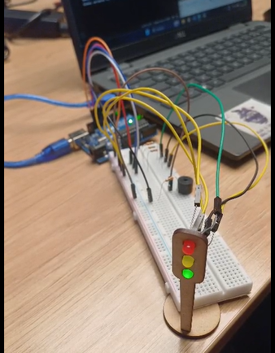

# ponderada-de-sala-4

## imagem do hardware:


### materiais: 
| **Item**              | **Descrição / Observação**         | **Quantidade** |
|------------------------|------------------------------------|----------------|
| LED                   | Diodo emissor de luz     | 3 unidades     |
| Resistores 330 Ω       | Resistores para limitação de corrente | 4 unidades     |
| Buzzer                | Emissor sonoro piezoelétrico       | 1 unidade      |
| Protoboard            | Protoboard 830 pontos              | 1 unidade      |
| Jumpers               | Cabos de conexão diversos          | Diversos       |
| Arduino               | Placa microcontroladora (UNO) | 1 unidade      |


## codigo:
``` c++
int x = 10;
int* p = &x;
#define BUZZER *p

class LED {
	int LredC;
	int LyelC;
	int LgreC;

public:
  LED (int LrC, int LyC, int LgrC) {

  LredC = LrC;
	LyelC = LyC;
	LgreC = LgrC;
    
  pinMode(LredC, OUTPUT);
  pinMode(LyelC, OUTPUT);
  pinMode(LgreC, OUTPUT);
  pinMode(BUZZER, OUTPUT);
  }
  void apita () {
  digitalWrite(LredC, HIGH);
  delay(6000); 

  digitalWrite(LyelC, HIGH);
  digitalWrite(LredC, LOW);
  delay(2000); 

  digitalWrite(LyelC,LOW);
  digitalWrite(LgreC, HIGH);
  tone(BUZZER, 392);
  delay(4000);

  digitalWrite(LgreC, LOW);
  noTone(BUZZER);
  }
};

LED leds(13, 12, 11);

void setup()
{}

void loop()
{
	leds.apita();
}
```
link do video de demonstração: [link](https://drive.google.com/file/d/1_r24__aUyEt4-2PgSn_q55IxkWEnfr8n/view?usp=sharing)
